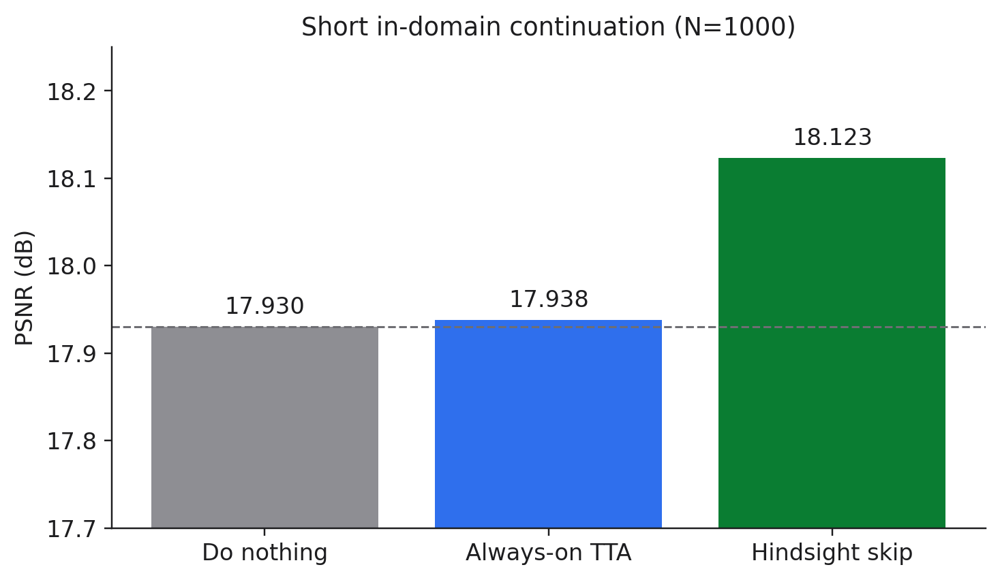
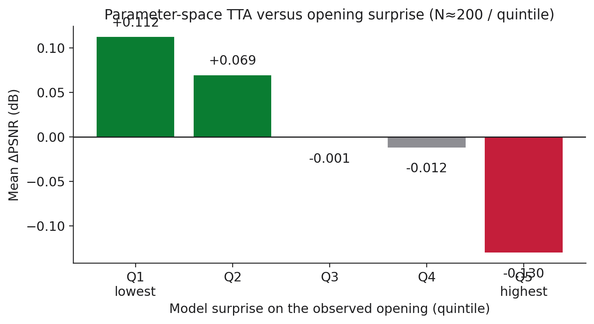
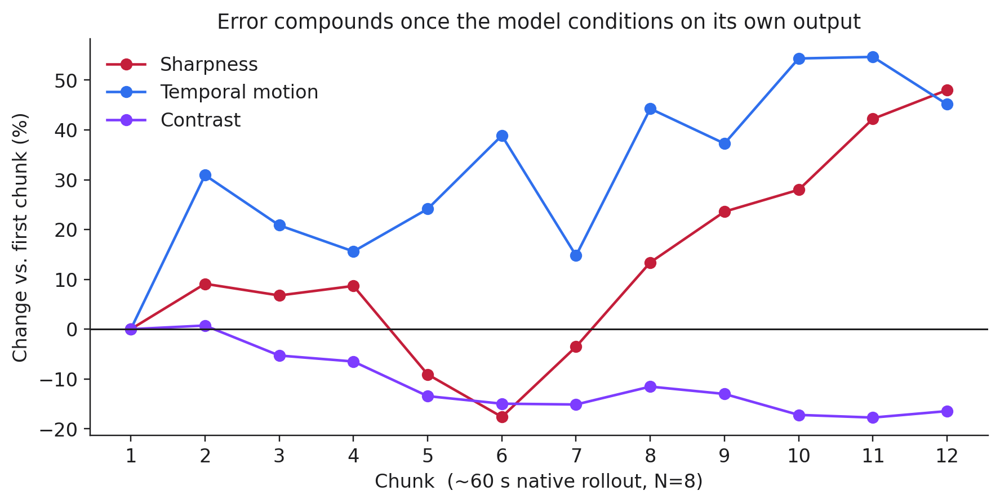
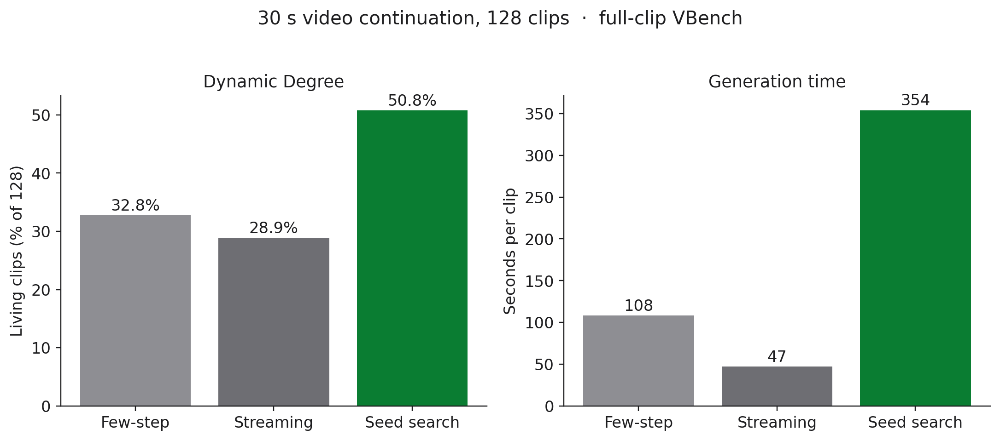
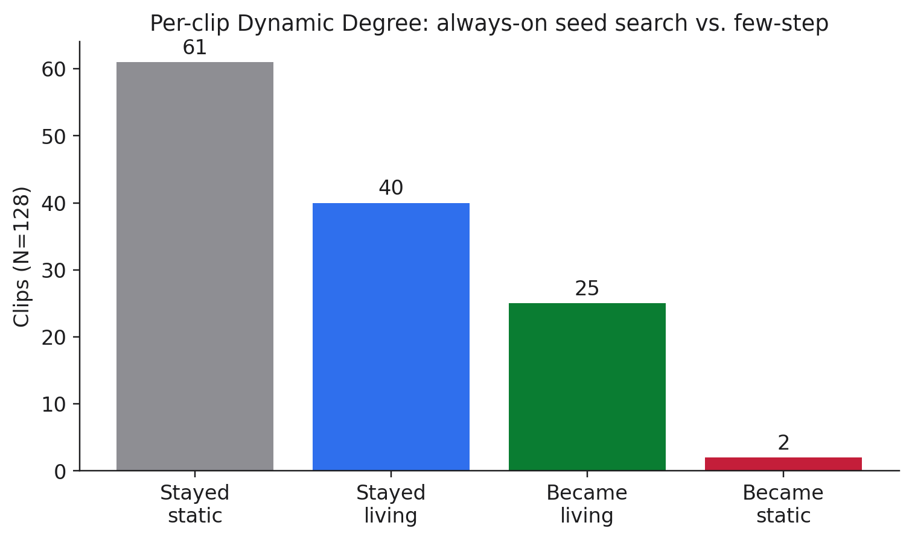
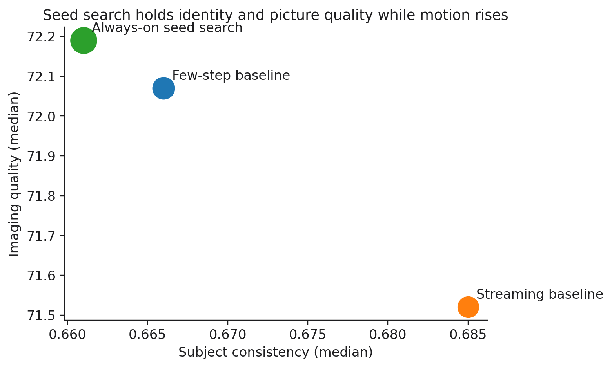
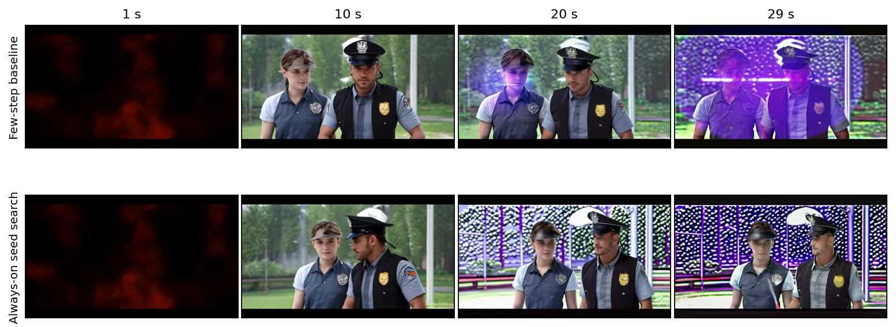
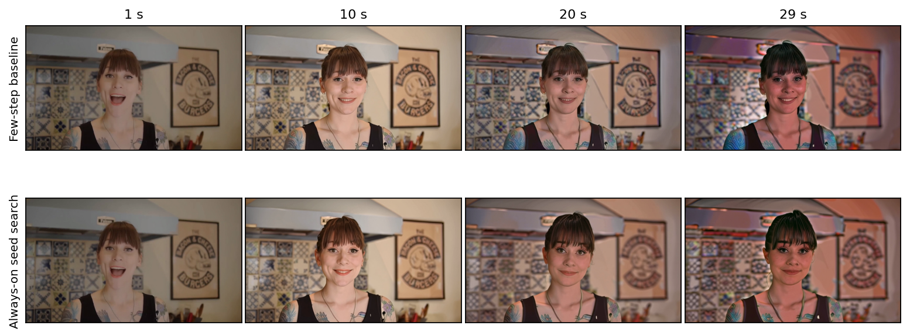

# Summer 2026 Progress Report

**Long-horizon video generation**
May–September 2026 · confidential partner briefing

This note follows the disclosure style of commercial lab technical
reports (for example OpenAI’s GPT-4 report and Anthropic’s Claude 3
model card). We describe the *problem*, the *class* of approach, and
*measured outcomes*. We do not disclose unpublished algorithm designs,
hyperparameters, training recipes, or the exact interventions now under
investigation.

Official quality is full-clip [VBench](https://vchitect.github.io/VBench-project/).
**Dynamic Degree** is the share of clips that still contain living
motion, not a median. Small protocol checks are not treated as results.

Figures live in `sponsor_summer_2026_figures/` next to this file.

---

## What we studied

A shipped video model will be asked for 30–60 seconds (and longer)
from a text prompt or from a short user clip. The failure we care about
is not a single bad frame. It is a tail that freezes, twitches, or
quietly rewrites the scene while still looking sharp.

The practical question for the summer was: if a frozen generator starts
to lose identity, motion, or picture quality as it rolls out, can extra
work *at inference* keep the continuation faithful — without retraining
the foundation model?

We evaluated on two related tasks. **Video continuation** gives the
model a few seconds of real context frames and asks it to invent the
unseen future. **Text-to-video self-continuation** starts from a prompt
and then conditions on its own output. Both become hard once generation
is autoregressive: each new chunk is fed the model’s previous pixels or
attention state.

---

## Why we left parameter-space methods

The first half of the summer stayed in **parameter space**: a small
test-time update (a global bias or a low-rank adapter), fit on the
frames we can see and left on for the invented tail. The hypothesis is
familiar from other domains — if this video is slightly off in identity
or motion style, a cheap correction on the opening should transfer to
the future.

On the short, in-domain continuation task (N=1000), that class of
method is not a product lever.

Always-on parameter-space adaptation sits on the do-nothing mean
(PSNR 17.93 → 17.94 dB). A larger adapter trades picture quality for
aesthetic and motion (Imaging Quality −0.034). About a quarter of
videos improve by more than 0.1 dB and about a quarter get worse. A
hindsight oracle that knew which videos to touch is +0.19 dB — real
headroom that requires a skip rule we do not have.

We tried to learn that skip rule from the opening alone: pixel
statistics, caption features, compressed-clip fingerprints, and the
frozen model’s own training loss on the observed frames. None of those
scores predicted “adaptation will help this video” at a useful
accuracy. The surprise proxy had the **wrong sign**. Clips that already
looked easy to the model gained a little; clips that surprised it lost
on average (lowest-surprise quintile +0.11 dB, highest −0.13 dB). Every
bucket still had large winners and large losers. A router that looked
useful on a 200-video pilot flipped sign at N=1000.

The same class of update remained null on native long-horizon
autoregressive rollout (paired test p ≥ 0.26). A global activation
nudge can shift population statistics. It does not cut per-video drift.

This is not only our measurement. Pathwise Test-Time Correction
(February 2026, [arXiv:2602.05871](https://arxiv.org/abs/2602.05871))
reaches the same conclusion in print: test-time parameter optimization
collapses on modern video generators; pretrained weights are sensitive
to small changes; the remaining lever is the **sampling trajectory**.

That is why we moved. Parameter space was the right first question on
the short task. Once the host is already strong there, the live problem
is long self-conditioning, and weight tweaks are the wrong handle.

---

## Why sampling space — and why distillation is on the table

Once each chunk is conditioned on the model’s own previous output,
error compounds with length. On a native ~60 s rollout (N=8),
sharpness rose about 48% and temporal motion about 45% by the last
chunk, while contrast fell about 16%. The 30 s read understated the
problem.

Sampling-space work means: keep the backbone frozen, and intervene on
the *draw* — try several random seeds and keep one; change what later
chunks are allowed to attend to; or edit the path inside a chunk. Those
are classes, not a recipe.

Distillation is the cost conversation. Always-on seed search can raise
quality, but it multiplies wall time. A later student that sees the
same sampling recipe in training can, in principle, amortize those
extra draws into one forward pass. We treat distillation as a
*direction*, not as a method we are ready to specify here.

---

## What we measured after the move

The citeable table is 30 s video continuation on 128 clips, using a
public few-step student and a public streaming baseline already
reported in the 2025–26 long-horizon literature. Against those
systems we also run **always-on seed search**: draw several random
seeds for each later chunk and keep the best. That is standard
Best-of-N sampling. We did not invent it. We report it because
randomness in the draw is a real lever on this stack — some
seeds stay still, others keep moving.

| | Subject | Imaging quality | Living clips | Seconds / clip |
|---|---:|---:|---|---:|
| Published few-step baseline | 0.666 | 72.07 | 32.8% (42 / 128) | 108 |
| Published streaming baseline | 0.685 | 71.52 | 28.9% (37 / 128) | 47 |
| Always-on seed search | 0.661 | 72.19 | **50.8% (65 / 128)** | 354 |

Seed search is the quality row in this table. Living clips move
from 32.8% to 50.8% while Imaging Quality and subject consistency
hold. Reconstruction versus the real tail is essentially unchanged.
The tradeoff is cost: about **3×** the few-step baseline. The
published streaming system is cheaper (47 s) and *loses* living
motion while gaining identity — the two fight.

The win is not a uniform lift. Twenty-five clips became living, two
lost living, forty were already living, and sixty-one stayed still.

**Other sampling-space classes did not give a quality win.** Rewarding
a continuation that stays close to the opening raises subject
consistency and drops tail motion: the opening is a good appearance
prior and a bad motion prior. Permanently pinning early frames in
attention buys identity and taxes living motion — the same trade the
published streaming baseline already makes. Edits to the noise path of
a frozen few-step student either collapse Imaging Quality or invent
camera motion the opening did not contain. Picking among seeds the
student already knows how to emit is safe. Changing the path of a
student that never trained on that path is not. That is also how the
published few-step and streaming systems are trained: train with the
recipe you will use at test.

---

## Frame-by-frame examples

The strips below are matched clips from the 128-clip table. Each row is
one system; columns are 1 s, 10 s, 20 s, and 29 s. Top is the published
few-step baseline. Bottom is always-on seed search.

**Clip A — a different seed woke a still continuation.** The few-step
baseline stays near-static through the tail. Always-on seed search
starts living motion without a visible identity rewrite.

**Clip B — both stay still.** Seed search does not invent motion on
every prompt. Sixty-one of 128 clips remain static under both systems.
The randomness helps a minority of borderline clips, not the whole set.

If a strip is missing in a local checkout, it is produced on the
cluster by `scripts/export_sponsor_frame_strips.py` after the 128-clip
videos are present.

---

## Research direction (without the recipe)

The summer’s usable conclusion is a map, not a named gadget.

Parameter-space test-time updates are the wrong handle on a saturated
short task and do not flatten long-horizon drift. Always-on seed search is the only class in this table that raised
living motion without breaking picture quality, and it is expensive.
We treat that as a known sampling fact, not a contribution. Frozen
path edits and permanently pinning the opening are unsafe or
identity-for-motion trades.

What we will work on next sits in the gap those facts leave. Long
sessions need some way to remember the opening after early frames leave
a bounded attention window — without copying those frames forever,
which published streaming systems already show collapses motion. They
also need a way to refuse a freeze or a scene rewrite so it is not
written back into whatever outlives the window. Separately, if seed
search remains the quality lever, a student trained under the same
draw could in principle pay the extra samples once, at train time.

We are not specifying an unpublished mechanism here. The forthcoming
academic paper is the place for that design. The first empirical check
is intentionally small; we will not scale a table until quality holds
on the official full-clip metrics.

---

## Limitations

- The 60 s drift audit is N=8. The direction is clear; the exact
  percentages should not be over-read.
- Dynamic Degree is a binary living/still call. We inspect clips when
  a Dyn-only lift could be flicker.
- Seed-search cost is hardware- and implementation-dependent. The 3×
  figure is our wall on this stack, not a theoretical minimum.
- This briefing does not include unpublished training runs.

---

## Sources (public)

- VBench: [vchitect.github.io/VBench-project](https://vchitect.github.io/VBench-project/)
- Pathwise Test-Time Correction, arXiv:2602.05871
- The few-step and streaming baselines we cite are the systems those
  papers already publish on; we do not restate their internals.
